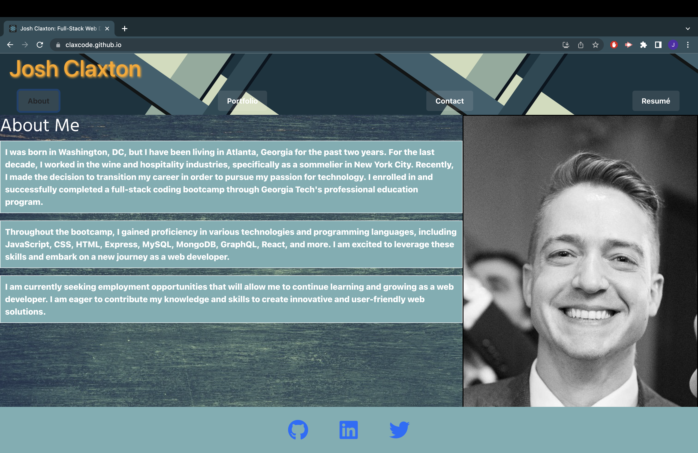

# react-portfolio

## Description

This repository contains a personal portfolio page built using React, Bootstrap, and Google Fonts. The intention is to showcase what I have accomplished up until this point, with the intention of adding to it as I continue to grow as a developer.

## Usage

To use this application, either visit the deployed GitHub Pages URL at https://claxcode.github.io/react-portfolio, or clone this repository, run `npm i` from the directory containing the repository, and then `npm start` to deploy locally.

## Features

This portfolio has several features. Built with the React for the frontend, this is a single-page application. There is dynamically altered CSS styling, as well as a copy of the my resumé that can be both viewed as well as downloaded. There is also a Contact page where the user can reach out to the author, although it is not currently connected to a database.

## Screenshots

About Me page

## Deployed Link

The deployed page can be visited at: https://claxcode.github.io/react-portfolio/

## Contact

To contact the author please use LinkedIn at  https://www.linkedin.com/in/joshua-claxton-916a2a272/